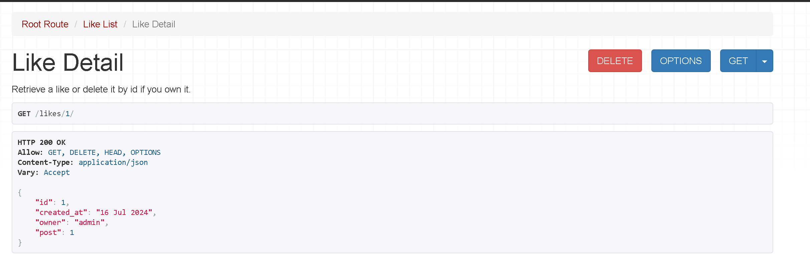

# Contentsharing API Manual Testing
## ProfileList View

### Test Cases:
1. Retrieve All Profiles:
- Make a GET request to /profiles/.
- Verify that the response contains a list of profiles.
- Check that each profile contains the annotated fields: posts_count, followers_count, following_count.

JSOM :
{"count":4,"next":null,"previous":null,"results":[{"id":4,"owner":"admin1","created_at":"16 Jul 2024","updated_at":"16 Jul 2024","name":"","content":"","image":"https://res.cloudinary.com/djkorqmgp/image/upload/v1/media/../default_profile_vc7caf","is_owner":false,"following_id":null,"posts_count":0,"followers_count":0,"following_count":0},{"id":3,"owner":"mohamed","created_at":"06 Jul 2024","updated_at":"06 Jul 2024","name":"","content":"","image":"https://res.cloudinary.com/djkorqmgp/image/upload/v1/media/../default_profile_tdu7ix","is_owner":false,"following_id":null,"posts_count":0,"followers_count":0,"following_count":0},{"id":2,"owner":"ali","created_at":"03 Jul 2024","updated_at":"03 Jul 2024","name":"","content":"","image":"https://res.cloudinary.com/djkorqmgp/image/upload/v1/media/../default_profile_tdu7ix","is_owner":false,"following_id":null,"posts_count":0,"followers_count":0,"following_count":0},{"id":1,"owner":"admin","created_at":"02 Jul 2024","updated_at":"02 Jul 2024","name":"","content":"","image":"https://res.cloudinary.com/djkorqmgp/image/upload/v1/media/../default_profile_tdu7ix","is_owner":false,"following_id":null,"posts_count":0,"followers_count":0,"following_count":0}]}

 ## ProfileDetail View
 ### Test Cases:
 - Retrieve a Profile:
   - Make a GET request to /profiles/<profile_id>/.
   - Verify that the response contains the profile details along with the annotated fields.

   JSON : {"id":1,"owner":"admin","created_at":"02 Jul 2024","updated_at":"02 Jul 2024","name":"","content":"","image":"https://res.cloudinary.com/djkorqmgp/image/upload/v1/media/../default_profile_tdu7ix","is_owner":false,"following_id":null,"posts_count":0,"followers_count":0,"following_count":0}

### Test Cases:
- Update a Profile (Owner Only):
   - Make a PUT/PATCH request to /profiles/<profile_id>/ as the owner of the profile.
   - Verify that the profile is updated successfully.
   - Check that unauthorized users cannot update the profile.
   

- ### Permissions
- Attempt to update a profile as a non-owner.
- Verify that the request is denied with an appropriate error message.

- ### Invalid Profile ID:
- Make a GET/PUT/PATCH request with an invalid profile ID.
- Verify that the response contains a 404 Not Found error.

## CategoryList View

- ### Test Cases:
- ### Retrieve All Categories:
  - Make a GET request to /categories/.
  - Verify that the response contains a list of categories.

  

  - ### Create a Category
  - Make a POST request to /categories/ with valid category data.
- Verify that the category is created and the response contains the new category data.
-  Ensure that unauthorized users cannot create a category if restrictions are applied.

- ### Invalid Category Creation

- Make a POST request with invalid or incomplete data.
- Verify that the response contains appropriate validation error messages.

# LikeList

- ## List Likes
-  Ensure that unauthenticated users can view the list of likes.
-  Verify that authenticated users can view the list of likes.

- ## Create Lik
    Verify that an authenticated user can create a like.
    Check that the created like is associated with the authenticated user.
    

- ## Create Like (Unauthenticated User):
- Verify that an unauthenticated user cannot create a like and receives an appropriate error message.

- ##  Delete Lik
- Verify that the owner of a like can delete it.
- Ensure the like is removed from the database after deletion.
